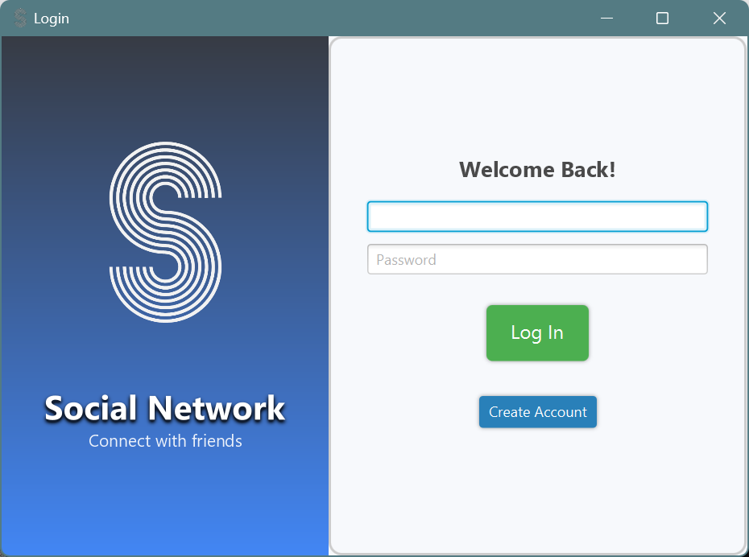

# Social Network Application

Welcome to the **Social Network Application**! This application provides a user-friendly platform for connecting with friends, managing friendships, and communicating seamlessly, all within an intuitive graphical user interface (GUI) developed using JavaFX.

---

## Features

### Key Functionalities:

- **User Authentication**: Secure login and registration functionality for personalized access.
- **Manage Friendships**:
  - View a list of friends.
  - Send and receive friend requests.
  - Get real-time notifications for new friend requests.
- **Chat Room**: Seamless communication through an interactive chat feature.
- **Database Integration**: Efficient and reliable management of user data and interactions.

---

## Screenshots

### Login Page

### Registration Page

### Main Menu

The main menu provides an overview of your friends and access to other functionalities.

### Friend Requests

Easily manage incoming and outgoing friend requests.

### Find New Friends

### Chat Room

Stay connected with friends through the chat room.

---

## License

This project is licensed under the [MIT License](LICENSE).

---

Enjoy connecting with your friends on the Social Network Application!
